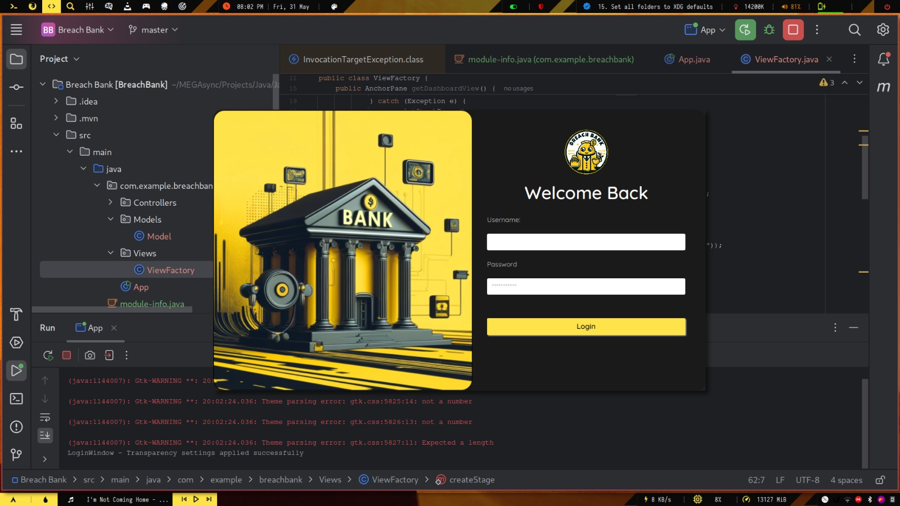

# Online Banking System

### Project Overview
**Project ID:** #CC3606  
**Project Title:** Online Banking System  
**Internship Domain:** Java Development Intern  
**Project Level:** Intermediate Level  
**Assigned By:** CodeClause Internship  
**Assigned To:** Adarsh 
**Start Date:** May 1, 2024  
**End Date:** May 31, 2024  

### Project Details

**Aim:**  
Design a comprehensive online banking system named "Brech Bank" with features like account management, fund transfers, and transaction history.

**Description:**  
Implement a Java application with a user-friendly interface that mimics online banking platforms, allowing users to perform various banking operations.

**Technologies:**  
- Java
- JavaFX for UI
- Database (e.g., MySQLite) for data storage

**What I Learned:**  
- Advanced UI development
- Database integration
- Transaction handling

