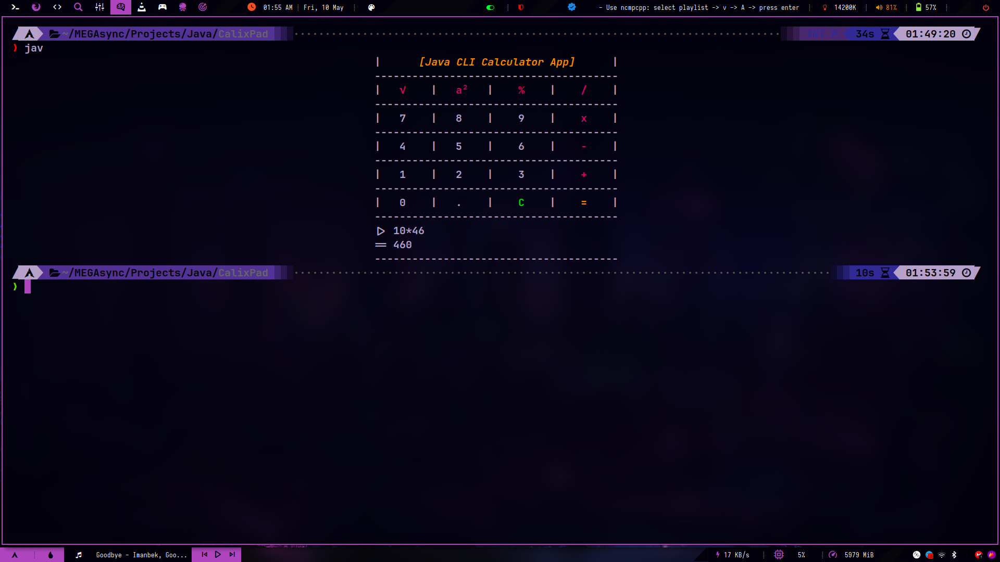
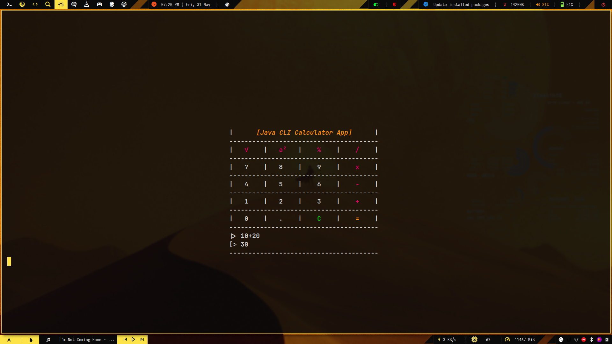

# Simple Calculator - CalixPad

### Project Overview
**Project ID:** #CC5255  
**Project Title:** Simple Calculator - CalixPad  
**Internship Domain:** Java Development Intern  
**Project Level:** Entry Level  
**Assigned By:** CodeClause Internship  
**Assigned To:** Adarsh
**Start Date:** May 1, 2024  
**End Date:** May 31, 2024  

### Project Details

**Aim:**  
Implement a basic calculator that performs addition, subtraction, multiplication, and division operations.

**Description:**  
Create a console-based calculator that takes user input for numbers and operations, and displays the result.

**Technologies:**  
Java (other technologies may be used as well)

**What I Learned:**  
- Basic arithmetic operations
- User input handling

1. Version 1 

2. Version 2 

### Further improvement - Todo

- [ ] Fix error handling
- [ ] Make all arethmitic operators accessible 
- [ ] Make the algoritham more efficient 
- [ ] Calculator Log history
- [ ] Config file for the Calculator 
- [ ] Vertical Centering 
- [ ] Live vertical and horizondal centering 
- [ ] Color

